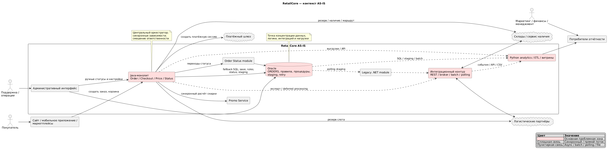

# Задание 2. Анализ текущего состояния платформы

## 1. Резюме текущего состояния

Платформа представляет собой Oracle-центричную систему оформления и обработки заказов. Java-монолит остаётся центральным оркестратором: создаёт заказ, рассчитывает цену, применяет промо, выбирает маршрут, резервирует доставку, создаёт платёжную сессию, меняет статусы и инициирует интеграционные выгрузки. Формально вынесенные сервисы не являются автономными: они зависят от модели, служебных полей, таблиц и последовательности вызовов монолита.

Фактическая архитектура гибридна. Для интеграций одновременно используются синхронные API, сообщения, общие и staging-таблицы Oracle, polling, batch-процессы и файловые выгрузки. Бизнес-правила распределены между Java-кодом, Oracle-процедурами и таблицами, конфигурацией интеграционного слоя, плановыми заданиями и ручными действиями операторов. Единого источника истины по заказу, его статусу, доставке и скидке нет.

Главное ограничение изменений — не размер монолита сам по себе, а скрытая связность. Изменение одного сценария может затронуть любую из составных частей монолита.

## 2. Architecture Canvas (AS-IS)

### 2.1. Value Proposition — ценностное предложение

| Область | Текущее состояние |
|---|---|
| Бизнес-возможность | Омниканальное оформление заказов через сайт, мобильное приложение и маркетплейсы; оплата, применение промо и организация доставки |
| Приоритет бизнеса | Не прерывать checkout; быстро запускать кампании, новые каналы, регионы и партнёрские сценарии |
| Компромисс | Доступность оформления часто важнее точной эквивалентности fallback-расчёта и немедленного подтверждения доставки |
| Операционные цели | Провести заказ, принять платёж, подобрать маршрут, передать заказ партнёрам, поддержать ручное восстановление зависших сценариев |
| Информационные цели | Получать отчёты по заказам, выручке, скидкам и логистике, хотя показатели сейчас различаются между витринами |

### 2.2. Key Stakeholders — ключевые стейкхолдеры

| Стейкхолдер | Интерес / ответственность | Основная проблема |
|---|---|---|
| Покупатели | Быстро оформить и оплатить заказ, получить корректный срок доставки | Задержки checkout; изменение уже обещанного срока |
| Бизнес и владельцы каналов | Быстро запускать кампании, регионы и партнёров | Изменения требуют учёта множества исключений |
| Маркетинг | Корректно применять промо и измерять кампании | Разные правила fallback и разные значения выручки/скидки |
| Финансы | Достоверные оплаты, отмены, возвраты и выручка | Представления заказа расходятся с маркетингом и операциями |
| Операционный блок и поддержка | Управлять маршрутизацией и восстанавливать заказы | Нужны ручные настройки и технические переходы статусов |
| Команда монолита | Стабильность оформления и развитие ядра | Высокая связность, длинные транзакции, скрытая логика Oracle |
| Команда логистики | Доставка и партнёрские интеграции | Разнородные протоколы, дубли, неоднозначные статусы |
| Команда аналитики | Отчётность и витрины | Нет канонической модели, lineage и единого потока событий |
| Внешние платёжные, складские и логистические партнёры | Получение заявок и возврат результатов | Разные контракты и способы обмена, повторные запросы |

### 2.3. Core Functions — ключевые функции

- Создание заказа для нескольких каналов и регионов.
- Расчёт базовой стоимости, канальных сборов и региональных надбавок.
- Применение промо через внешний сервис с fallback на Oracle-пакет.
- Сохранение заказа и ведение расширенного жизненного цикла статусов.
- Выбор маршрута с учётом региона, доставки, канала, склада, категории, партнёра и ручных исключений.
- Резервирование доставки и отложенные повторные попытки при сбое.
- Создание платёжной сессии.
- Передача заказов складам, логистическим партнёрам, маркетплейсам и промежуточному .NET-модулю.
- Формирование уведомлений, выгрузок и данных для отчётности.
- Ручная обработка исключений и восстановление зависших заказов.

### 2.4. Quality Requirements — требования к качеству

| Атрибут | Потребность | AS-IS оценка |
|---|---|---|
| Доступность | Checkout должен продолжать работу при частичных сбоях | Частично обеспечивается fallback и deferred processing, но не для всех зависимостей |
| Производительность | Стабильное время ответа, особенно на распродажах | Ограничено синхронными вызовами, длинными транзакциями и тяжёлыми SQL |
| Согласованность | Однозначные цена, статус и доставка | Нарушена из-за нескольких владельцев состояния и отложенных коррекций |
| Изменяемость | Быстрый запуск правил, каналов и партнёров | Низкая: правила и зависимости распределены по разным слоям |
| Надёжность интеграций | Безопасные retries без дублей | Реализована неоднородно; идемпотентность не гарантирована везде |
| Наблюдаемость | Сквозная история заказа | Недостаточна: correlation ID и централизованные данные есть не во всей цепочке |
| Аналитическая достоверность | Одинаковые бизнес-показатели | Недостаточна: несколько «почти канонических» моделей и разная трактовка данных |

### 2.5. Business Context — бизнес-контекст

| Внешний участник / система | Роль в контексте | Основной поток | Влияние на качества и риски |
|---|---|---|---|
| Сайт и мобильное приложение | Клиентские каналы | Команды создания заказа, корзина, данные клиента; ответ checkout | Чувствительны к общей задержке и частичным сбоям |
| Маркетплейсы | Внешние каналы продаж | Заказы через специальные API и канальные ветки | Особые сборы, статусы и обратная совместимость |
| Promo Service | Источник расчёта скидки | Синхронный запрос скидки | Недоступность включает неэквивалентный Oracle fallback |
| Платёжный шлюз | Создание платёжной сессии | Синхронный запрос и redirect URL | Критическая зависимость checkout; при отказе заказ уже сохранён |
| Склады / сервис наличия | Наличие и резервирование | Преимущественно синхронные запросы | Задержки непосредственно ухудшают checkout |
| Логистические партнёры | Резерв слота, приём заявки, статусы | REST, broker, batch или промежуточный .NET-контур | Разные SLA и контракты; возможны задержки и дубли |
| Операторы поддержки | Разрешение исключений | Административные изменения статуса и настроек | Обеспечивают восстановление, но создают риск слабого аудита |
| Потребители отчётности | Маркетинг, финансы, операции и менеджмент | Витрины и отчёты | Получают различающиеся трактовки заказа и показателей |

Ключевые ограничения и внешние зависимости контекста:

- Oracle — операционная БД, хранилище правил и справочников, среда выполнения процедур, интеграционный транспорт и источник аналитики.
- Core order create и payment orchestration нельзя безопасно заменить одним шагом без инвентаризации скрытых зависимостей.
- Каналы неэквивалентны: сайт, мобильное приложение и маркетплейсы проходят разные ветви.
- Критичны обратная совместимость старых API, служебных полей и специальных партнёрских статусов.
- Работа должна продолжаться при недоступности части внешних систем, поэтому существуют fallback, retries, batch и ручные операции.
- Актуальная документация потоков отсутствует; существенная часть знаний находится у сотрудников.
- Настройки маршрутов могут меняться вручную и без полного change process.

### 2.6. Components / Modules — компоненты и модули

| Компонент / модуль | Ответственность AS-IS | Ключевые зависимости |
|---|---|---|
| Java-монолит | Checkout, заказ, цена, часть промо и маршрутизации, оркестрация платежа и доставки | Oracle, Promo Service, payment, availability, logistics |
| Oracle | Заказы, история/статусы, справочники, правила, packages, staging и retry-таблицы | Монолит, .NET-модуль, batch и аналитика |
| Promo Service | Расчёт скидки для части сценариев | Вызывается монолитом; fallback находится в Oracle |
| Order Status module | Изменение части статусов заказа | Монолит и Oracle; не является единственным владельцем переходов |
| Интеграционный контур | Обмен со складами, доставкой и партнёрами | REST, брокер, таблицы, polling и jobs |
| Legacy .NET module | Посредник для части старых интеграций | Получает данные через Oracle staging |
| Batch/jobs | Повторные попытки, статусы, актуализация маршрутов, выгрузки | Oracle и внешние системы |
| Административный интерфейс | Ручные настройки и восстановление статусов | Монолит и Oracle |
| Python analytics / ETL / витрины | Сбор, преобразование и публикация отчётных данных | Oracle, staging, API, выгрузки и CSV |

### 2.7. Core Decisions — ключевые решения, удачные и проблемные

| Решение | Первоначальная / текущая ценность | Негативное следствие AS-IS |
|---|---|---|
| Монолит — центральный оркестратор и владелец базовой модели заказа | Единая точка реализации процесса, быстрый запуск изменений | Высокая связность и большой радиус изменения/отказа |
| Синхронные вызовы на пути checkout | Немедленный ответ о платеже, промо и доставке | Суммирование задержек и каскадная деградация |
| Точечные fallback и deferred processing | Заказ можно принять при части сбоев | Неэквивалентное поведение и промежуточные состояния |
| Oracle packages и таблицы правил | Быстрые изменения и близость к данным | Логика скрыта от модели приложения и трудно переносима |
| Staging-таблицы как контракт с .NET | Простая историческая интеграция | Жёсткая связность со схемой общей БД |
| Несколько механизмов async-обмена | Адаптация под возможности разных партнёров | Разная семантика retries, дедупликации и мониторинга |
| Прямое чтение Oracle аналитикой | Быстрое получение полных данных | Нагрузка на OLTP и сильная зависимость аналитики от операционной модели |
| Ручные статусы и настройки | Практический способ восстановить зависший заказ | Риск ошибок, слабый аудит и зависимость от экспертного знания |

### 2.8. Technologies — технологии

| Технология / механизм | Наблюдаемое использование |
|---|---|
| Java | Монолитное ядро |
| Oracle Database / SQL / packages | Операционные данные, правила, fallback-расчёты, staging, retries, jobs |
| .NET | Промежуточный legacy-модуль части интеграций |
| Python | Аналитические задачи, ETL и отчётность |
| REST / синхронные API | Promo, payment, availability и часть logistics |
| Message broker | Часть асинхронных интеграций; конкретный продукт не установлен |
| Polling и batch | Чтение staging, повторные попытки, обновление статусов и маршрутов |
| CSV / файловые выгрузки | Часть старых аналитических потоков |
| Централизованные логи и метрики | Есть в новых сервисах; неполны в монолите и сквозной цепочке |

Фреймворки, конкретный брокер, инфраструктурная платформа и средства мониторинга в артефактах не названы и намеренно не предполагаются.

### 2.9. Risks and Missing Information — риски и недостающая информация

#### Реестр проблемных зон и рисков

| ID | Проблема / риск | Проявление | Последствие | Критичность |
|---|---|---|---|---|
| R1 | Монолит и Oracle — точки концентрации отказа и нагрузки | Почти каждый заказ проходит через них | Деградация checkout и большой радиус отказа | Критическая |
| R2 | Распределённые бизнес-правила | Код, БД, конфиги, jobs, ручные исключения | Непредсказуемый эффект изменений | Критическая |
| R3 | Нет единого владельца статуса | Монолит, платёжный модуль, batch и операторы меняют состояние | Зависшие/невозможные переходы, ручное восстановление | Высокая |
| R4 | Синхронные внешние вызовы в checkout | Promo, payment, availability/logistics | Рост задержки и каскадные сбои | Высокая |
| R5 | Неатомарный сквозной процесс | Заказ сохранён до подтверждения доставки и платежа | Состояния `*_PENDING`, частично завершённые операции | Высокая |
| R6 | Неэквивалентный promo fallback | Oracle считает скидку по урезанным правилам | Разная цена для одинакового намерения клиента | Высокая |
| R7 | Общая БД как интеграционный контракт | Прямые записи и polling staging-таблиц | Скрытая связность схемы и сложная миграция | Критическая |
| R8 | Неоднородные retries и идемпотентность | Повторная отправка при молчании партнёра | Дубли заявок и ручной разбор | Высокая |
| R9 | Аналитика нагружает OLTP | Тяжёлые SQL и исторические выборки в Oracle | Конкуренция с оформлением заказа | Высокая |
| R10 | Нет канонической модели и lineage | Разные витрины по-разному трактуют заказ | Конфликт бизнес-показателей и недоверие к данным | Высокая |
| R11 | Недостаточная наблюдаемость | Нет сквозного correlation ID | Медленная диагностика межсистемных сбоев | Средняя/высокая |
| R12 | Ручные изменения с ограниченным контролем | Ночные правки приоритетов, ручные статусы | Ошибки, слабый аудит, зависимость от людей | Высокая |

Недостающая информация, влияющая на достоверность Canvas, перечислена в разделе 6. В первую очередь неизвестны реальные транзакционные границы, полный автомат статусов, каталог Oracle-логики, SLA интеграций и гарантии доставки сообщений.

## 3. AS-IS диаграмма контекста

### 3.1. Основной поток создания заказа

1. Канал передаёт команду создания заказа монолиту.
2. Монолит рассчитывает базовую цену, сборы и надбавки.
3. Promo Service рассчитывает скидку; при пустом результате используется Oracle fallback.
4. Заказ сохраняется, после чего монолит отдельно пишет запись в `INT_ORDER_EXPORT`.
5. Правило маршрута читается из репозитория/Oracle; заказ может уйти на ручную проверку.
6. Монолит синхронно резервирует доставку. При отказе сохраняет `DELIVERY_PENDING` и запись в `RETRY_DELIVERY_QUEUE`.
7. Монолит синхронно создаёт платёжную сессию. При отказе устанавливает `PAYMENT_PENDING` и выбрасывает исключение, хотя заказ уже сохранён.
8. При успехе статус меняется на `CONFIRMED`, а платёжная сессия и партнёр доставки обновляются прямым SQL.

Этот поток демонстрирует частично завершённые состояния, отсутствие одной атомарной границы для бизнес-процесса и смешение оркестрации, правил, хранения и интеграции.

## 4. Анализ исходных артефактов

| Артефакт | Что представляет собой | Какую область знаний покрывает | Краткий вывод |
|---|---|---|---|
| Интервью с техническим лидером | Экспертное описание монолитного ядра | Оформление заказа, цена, промо, статусы, Oracle и эксплуатация | Монолит остаётся центральным оркестратором, а бизнес-логика распределена между кодом, БД и ручными операциями. |
| Интервью с разработчиком логистики | Описание логистических и партнёрских интеграций | Маршрутизация, доставка, способы обмена и обработка сбоев | Интеграционный контур неоднороден: используются API, брокер, таблицы и batch; правила маршрутизации распределены по нескольким слоям. |
| Интервью с разработчиком аналитики | Описание получения и использования отчётных данных | Источники данных, ETL, витрины и качество данных | Аналитика зависит от операционной Oracle и разнородных выгрузок; единой канонической модели заказа нет. |
| `OrderProcessingService.java` | Фрагмент реализации создания заказа в Java-монолите | Реальный поток checkout и технические зависимости | Код подтверждает смешение бизнес-логики, доступа к Oracle и синхронных внешних вызовов, а также наличие промежуточных состояний заказа. |

## 5. Основные ограничения для изменений

- Бизнес-логика распределена между Java-кодом, Oracle, конфигурацией, batch-процессами и ручными операциями, поэтому изменение нельзя оценивать только по коду монолита.
- Каналы, регионы и партнёры используют разные правила и исключения, что ограничивает возможность унифицированной миграции сценариев.
- Монолит и Oracle связаны со множеством систем через синхронные вызовы, общие таблицы и служебные поля; это затрудняет независимый вынос компонентов.
- Изменения checkout, статусов и интеграций требуют поэтапного внедрения из-за промежуточных состояний, повторной обработки и бизнес-критичности оформления заказа.
