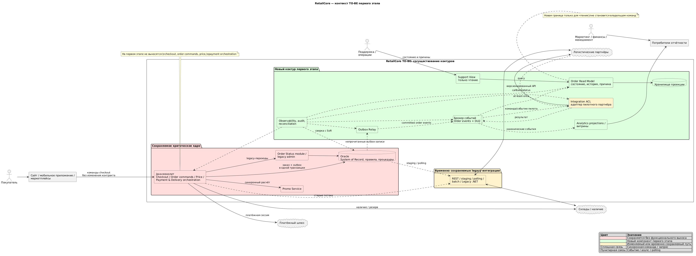

# Задание 3. Трансформация RetailCore и целевая архитектура

## 0. Паспорт документа

| Поле | Значение |
|---|---|
| Название проекта | Поэтапная трансформация RetailCore |
| Бизнес-сценарий | Омниканальное оформление и исполнение заказа |
| Горизонт целевой архитектуры | Первый управляемый этап миграции |
| Версия | 1.0 |
| Связанные документы | `../Task1/requirements.md`, `../Task2/architecture-analysis.md`, `retailcore-context-to-be.puml` |

## 1. Краткое резюме трансформации

RetailCore должна сохранить устойчивость оформления заказов и одновременно сократить число инцидентов, ручных разборов и риск коммерческих изменений. Сейчас этому мешают скрытая связность Java-монолита и Oracle, несколько владельцев статуса, неоднородные интеграции и прямое чтение OLTP аналитикой. На первом этапе критический checkout, создание заказа, платёжная оркестрация и запись в Oracle остаются в монолите. Вокруг ядра вводятся надёжная публикация событий заказа, единая операционная read-модель, адаптеры интеграций и отдельный аналитический контур. Изменения внедряются параллельно существующим потокам с теневым сравнением, feature flags и возможностью отката. Это реалистичный промежуточный этап, а не полная замена легаси.

## 2. Бизнес-цель и критерии успеха

| Элемент | Описание |
|---|---|
| Бизнес-цель | Сохранить выручкообразующий order flow и сделать изменения и обработку отклонений предсказуемее |
| Пользовательская ценность | Согласованный понятный статус заказа без потери оформления при миграции |
| Операционный эффект | Сквозная история заказа, причины отклонений, меньше ручного поиска по системам |
| Горизонт проверки | После пилота на одном канале/партнёре и стабильной работы в согласованный период |
| Ограничения результата | Этап не заменяет Oracle, монолит, платёжную оркестрацию и весь автомат статусов |

### 2.1. Метрики успеха

Численные пороги нельзя задавать до измерения baseline и согласования SLO.

| Метрика | AS-IS | Цель TO-BE | Источник | Контроль |
|---|---|---|---|---|
| Успешность checkout и p95/p99 | Не задано | Не хуже baseline в пределах согласованного допуска | APM и бизнес-события | Непрерывно |
| Доля заказов с полной коррелированной историей | Не измерено | Согласованный SLO пилота | Журнал событий/read-модель | Ежедневно |
| Время диагностики отклонения заказа | Не измерено | Снижение относительно baseline | Система поддержки | Еженедельно |
| Расхождение read-модели с Oracle | Не измерено | Ниже согласованного порога | Reconciliation job | Ежедневно |
| Тяжёлые аналитические чтения из OLTP | Есть | Снижение для мигрированных витрин | Аудит Oracle | Еженедельно |

## 3. Краткое описание AS-IS

| Область | Текущее состояние | Значение для трансформации |
|---|---|---|
| Процесс | Монолит синхронно считает цену, вызывает promo, доставку и payment; после сохранения возможны `*_PENDING` | Нельзя одномоментно разрезать транзакцию и обещания клиенту |
| Компоненты | Java-монолит и Oracle концентрируют логику, данные и оркестрацию | Большой радиус изменения и скрытые зависимости |
| Данные | Статусы меняют монолит, модуль статусов, batch и операторы | Нет единой объяснимой истории |
| Интеграции | REST, broker, staging, polling, batch и файлы | Разные retries, идемпотентность и наблюдаемость |
| Эксплуатация | Ручные статусы и настройки компенсируют архитектурные пробелы | Высок риск ошибки и слабого аудита |
| Аналитика | Тяжёлые SQL, staging, API и CSV читают операционный контур | Конкуренция с checkout и разные трактовки данных |

## 4. Ограничения и допущения

| Тип | Формулировка | Влияние на архитектуру |
|---|---|---|
| Бизнес | Нельзя останавливать продажи ради миграции | Только обратимые инкременты и сосуществование контуров |
| Техническое | Java и Oracle обслуживают критические операции | На первом этапе остаются источником командной модели заказа |
| Данные | Десятки ТБ, неполное архивирование, скрытая Oracle-логика | Нет массового переноса; история наращивается событиями, старые данные — по запросу |
| Интеграции | Каналы и партнёры неэквивалентны | Пилот по одному сценарию, версионирование и ACL |
| Инфраструктура | On-prem близок к пределу, целевая платформа не названа | Не фиксируется конкретный брокер/СУБД; требуется capacity test |
| Знания | Документация и NFR неполны | Перед cutover обязательны инвентаризация, baseline и контрактные тесты |
| Допущение | Существующий брокер можно использовать либо расширить | Проверить гарантии доставки, retention и пропускную способность |

## 5. Препятствия первого этапа

| Препятствие | Где проявляется | Влияние | Можно изменить? | Решение |
|---|---|---|---|---|
| Нет надёжного потока изменений заказа | Oracle/staging/batch | Потери, задержки и разные данные | Да | Transactional outbox и канонические события |
| Нет единой истории и владельца представления статуса | Поддержка и каналы | Долгая диагностика, рассинхронизация | Частично | Read-модель и отображение статусов; command ownership пока в монолите |
| Неоднородные интеграции | Склады/логистика/.NET | Дубли и скрытая связность | Частично | ACL-адаптеры с едиными retry/idempotency правилами |
| Аналитика читает OLTP | Oracle/ETL | Риск деградации checkout | Да для пилотных витрин | Событийная аналитическая проекция |
| Распределённые правила checkout | Java/Oracle/config | Высокий риск регрессии | Нет | Инвентаризация и characterization tests; будущий этап |

## 6. Точки трансформации

| № | Точка | Проблема AS-IS | Целевое изменение | Ограничения | Метрика | Владелец |
|---:|---|---|---|---|---|---|
| 1 | Надёжный событийный шов | Запись заказа и экспорт неатомарны | Outbox в транзакции Oracle, relay, версионированные события | Oracle остаётся SoR; at-least-once | Потери/дубли, lag | Команда платформы |
| 2 | Операционная проекция заказа | История разбросана | Read-модель состояния, хронологии и причины отклонения | Не принимает команды и не заменяет Oracle | Полнота, корректность, среднее время на восстановление | Команда заказов/поддержки |
| 3 | Антикоррупционный слой интеграций | Таблицы и протоколы раскрывают легаси | Адаптеры, idempotency key, единые retries/DLQ | Пилот одного партнёра | Дубли, success rate, retry age | Команда интеграций |
| 4 | Отделение аналитических чтений | BI конкурирует с OLTP | Проекции/витрины из событий, reconciliation | Не мигрировать всю историю сразу | Нагрузка OLTP, расхождения | Команда данных |
| 5 | Сквозная наблюдаемость и аудит | Нет общей корреляции | `correlationId`, метрики, аудит ручных действий | Совместимость старых контрактов | Доля трассируемых заказов | Эксплуатация |

### 6.1. Паспорта точек трансформации

#### Надёжный событийный шов

| Вопрос | Ответ |
|---|---|
| Бизнес-цель | Устойчивость order flow и доверенные данные |
| Где в AS-IS | `ORDERS`, `INT_ORDER_EXPORT`, batch/polling |
| Проблема | Сохранение и публикация разделены, возможны пропуски и повторная отправка |
| TO-BE | Outbox пишется вместе с изменением заказа; relay публикует версионированное событие |
| Не меняется | Checkout, таблицы заказа и решение о переходе статуса |
| Контроль | Consumer idempotency, lag, reconciliation; остановка пилота при потере события или влиянии на checkout |

#### Операционная проекция заказа

| Вопрос | Ответ |
|---|---|
| Бизнес-цель | Сократить ручные разборы и дать единую картину заказа |
| Где в AS-IS | Oracle, модуль статусов, batch, административный интерфейс |
| Проблема | Текущее состояние и причины приходится восстанавливать из нескольких источников |
| TO-BE | Проекция хранит хронологию, фактический и клиентский статус, следующий шаг и причину отклонения |
| Не меняется | Проекция не управляет жизненным циклом и не выполняет ручные команды |
| Контроль | Полнота/freshness, сравнение с Oracle, пилот только в режиме чтения |

#### Антикоррупционный слой интеграций

| Вопрос | Ответ |
|---|---|
| Бизнес-цель | Снизить инциденты и ускорить подключение партнёров |
| Где в AS-IS | REST, broker, staging, .NET, polling, batch |
| Проблема | Разная семантика контрактов, повторов и ошибок |
| TO-BE | Внутренний канонический контракт и отдельные адаптеры партнёров |
| Не меняется | Немигрированные партнёры используют старый путь |
| Контроль | Feature flag, canary, идемпотентность; откат при росте ошибок/дублей |

#### Аналитические проекции и наблюдаемость

| Вопрос | Ответ |
|---|---|
| Бизнес-цель | Доверенные показатели без риска для checkout и быстрая диагностика |
| Где в AS-IS | Oracle/ETL/CSV и разрозненные логи |
| Проблема | OLTP нагружен, lineage и сквозной correlation ID отсутствуют |
| TO-BE | Событийные витрины, сверка с SoR, единая корреляция и аудит |
| Не меняется | Старые отчёты остаются до доказанной эквивалентности |
| Контроль | Shadow comparison, Oracle load, полнота трасс; возврат к старой витрине при расхождении |

## 7. Матрица прослеживаемости

| Препятствие | Бизнес-эффект | Точка | Решение | Метрика |
|---|---|---|---|---|
| Неатомарный экспорт | Надёжная видимость заказа | Событийный шов | Outbox + relay | Потери, lag |
| Разрозненные статусы | Быстрая поддержка | Read-модель | Каноническая проекция | Полнота, MTTR |
| Разные интеграционные механизмы | Меньше дублей/ошибок | ACL | Адаптеры + idempotency/DLQ | Duplicate/error rate |
| Прямые SQL аналитики | Защита checkout | Аналитические проекции | Event-fed витрины | OLTP load, reconciliation |
| Нет корреляции | Быстрая диагностика | Наблюдаемость | Correlation ID и аудит | Trace coverage |

## 8. Анализ связности

| Вид | AS-IS | Последствие | Ослабление в TO-BE |
|---|---|---|---|
| По данным | Общая Oracle, staging, служебные поля | Изменение схемы ломает потребителей | Outbox-события, read-модели, ACL |
| По вызовам | Синхронные promo/payment/availability/delivery | Суммирование задержек | На этом этапе не ломаем критический путь; async только после commit |
| По развёртыванию | Логика внутри монолита и Oracle packages | Общий рискованный релиз | Отдельные consumers/adapters, feature flags |
| По процессу | Несколько владельцев статуса и ручные обходы | Невозможные переходы | Каноническое отображение и аудит; ownership команд — будущий этап |

## 9. Транзакционные границы

| Операция | AS-IS | TO-BE первого этапа | Согласованность | Ошибка/компенсация |
|---|---|---|---|---|
| Создание/изменение заказа | Oracle-транзакция плюс отдельный export | Заказ и outbox в одной Oracle-транзакции | Строгая внутри монолита; eventual для проекций | Relay повторяет, consumers дедуплицируют |
| Платёжная сессия | Синхронно после сохранения заказа | Без изменения | Существующая модель | Существующий `PAYMENT_PENDING`; наблюдаемость добавляется |
| Доставка | Sync и retry-таблица | Старый путь либо пилотный adapter | Eventual при retry | Идемпотентный повтор, DLQ, ручная эскалация |
| Read-модель/аналитика | SQL/batch | События после commit | Eventual | Rebuild/replay и reconciliation |

## 10. Целевая архитектура первого этапа

### 10.1. Границы TO-BE

Входит: outbox и relay; канонические события заказа; операционная read-модель; интерфейс поддержки только для чтения; пилотный ACL-адаптер; аналитические проекции; корреляция, аудит и reconciliation.

Не входит: перепись монолита; замена Oracle; перенос command ownership заказа/статусов; изменение расчёта цены и promo fallback; вынос payment orchestration; одномоментная миграция всех партнёров и истории.

### 10.2. Компоненты TO-BE

| Компонент | Статус | Ответственность | Данные/связи |
|---|---|---|---|
| Java-монолит | Существующий, минимально изменяемый | Checkout, order commands, цена, payment/delivery orchestration | Oracle и прежние внешние API |
| Oracle | Существующий | System of record и legacy-логика | Заказы, правила, outbox |
| Outbox relay | Новый | Публикация committed events | Oracle outbox → broker |
| Брокер событий | Существующий/расширяемый | Доставка версионированных событий | Consumers, retention/DLQ |
| Order Read Model | Новый | История и представление статуса | События → отдельное хранилище |
| Support View | Изменяемый/новый | Просмотр состояния и причин | Только read-модель; команды остаются legacy |
| Integration ACL | Новый, пилот | Канонический контракт и адаптация партнёра | Broker/API → внешние системы |
| Analytics projections | Новый/изменяемый | Витрины без прямого OLTP-чтения | События + сверка Oracle |
| Observability/Reconciliation | Новый/изменяемый | Корреляция, SLI, аудит, сверка | Все новые компоненты и Oracle |

### 10.3. Ключевые решения

| № | Решение | Почему | Ограничение | Риск |
|---:|---|---|---|---|
| 1 | Strangler вокруг монолита, а не замена ядра | Минимизирует риск для продаж | C-01/C-03 | Легаси остаётся bottleneck |
| 2 | Transactional outbox в Oracle | Закрывает dual-write без распределённой транзакции | Oracle остаётся SoR | Нагрузка/рост таблицы |
| 3 | CQRS только для чтения | Даёт ценность поддержке без переноса команд | Неизвестен автомат статусов | Eventual consistency |
| 4 | ACL и миграция партнёров по одному | Изолирует нестабильные контракты | Неэквивалентные каналы | Два пути на период миграции |
| 5 | Shadow comparison до переключения | Проверяет эквивалентность и обратимость | Нет baseline | Дополнительная нагрузка |

## 11. Диаграмма TO-BE

На схеме красным показано сохраняемое критическое ядро, зелёным — новые компоненты первого этапа, жёлтым — изменяемые/пилотные элементы. Сплошные линии обозначают синхронные команды и запросы, пунктирные — события и отложенную обработку.

## 12. Разрывы между AS-IS и TO-BE

| Область | AS-IS | TO-BE | Разрыв и закрытие |
|---|---|---|---|
| Процесс | Поддержка собирает картину вручную | Единая проекция | Ввести события, mapping статусов и пилот Support View |
| Данные | Oracle читают многие потребители | Стабильные события и проекции | Outbox, schemas, retention, reconciliation |
| Интеграции | API/staging/polling/batch | ACL для мигрированного партнёра | Контрактные тесты, idempotency, feature flag |
| Наблюдаемость | Частичные логи | Сквозная корреляция и SLI | Протянуть ID, dashboards и alerts |
| Эксплуатация | Неаудируемые ручные действия | Видимая история; команды пока legacy | Аудит, RBAC после уточнения NFR, runbooks |

## 13. Риски и открытые вопросы

| Риск/вопрос | Влияние | Контроль | Владелец | До чего уточнить |
|---|---|---|---|---|
| Реальные транзакционные границы Oracle неизвестны | Outbox может быть неполным | Инвентаризация кода/packages и тесты сбоев | Техлид монолита | До реализации relay |
| Полный автомат статусов неизвестен | Неверное отображение | Каталог переходов и shadow comparison | Команда заказов | До показа клиентам |
| Гарантии брокера не подтверждены | Потери/дубли/lag | Проверить delivery, retention, DLQ, capacity | Инфраструктура | До пилота |
| Дополнительная запись повышает нагрузку Oracle | Деградация checkout | Load test, индексы, retention, kill switch | DBA/эксплуатация | До production |
| Два интеграционных пути расходятся | Разные результаты | Canary, reconciliation, один владелец routing flag | Интеграции | На всём пилоте |
| Нет численных SLO/RTO/RPO | Нельзя формально принять этап | Baseline и согласование со спонсором | Бизнес/эксплуатация | До cutover |
| Требования безопасности не подтверждены | Риск доступа/аудита | Классификация данных, RBAC, retention | Security/владелец данных | До выдачи Support View |

## 14. Проверка качества

- [x] Цель связана с архитектурными изменениями.
- [x] Точки трансформации имеют метрики и владельцев.
- [x] Явно разделены первый и будущие этапы.
- [x] Сохранены критические части монолита и Oracle.
- [x] Показаны границы, легаси, новые интеграции и ключевые потоки.
- [x] Зафиксированы зависимости, риски, условия пилота и отката.
