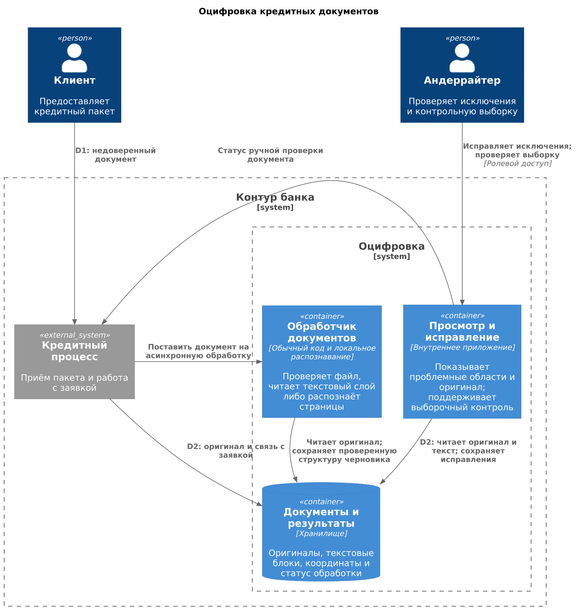
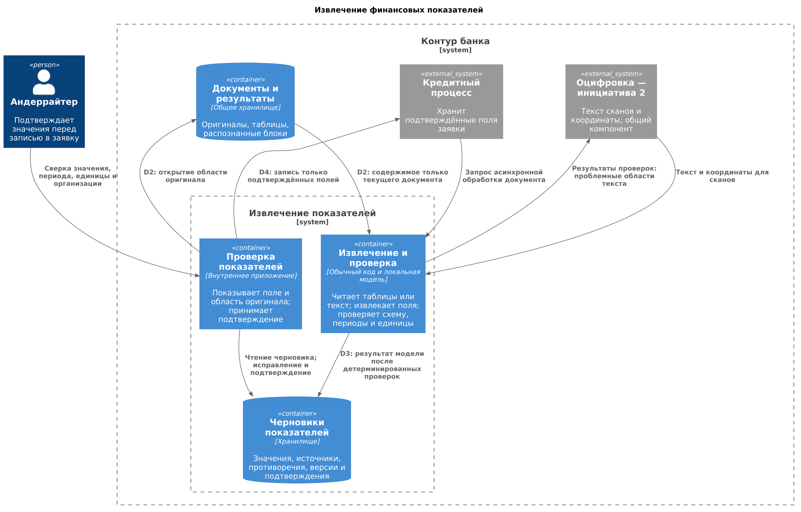

# C4 Container. Кредитные документы

Обе схемы описывают предлагаемые приложения и хранилища. Общие узлы кредитного процесса и распознавание используются совместно.

## Инициатива № 2. Оцифровка

[Исходник PlantUML](ocr-container.puml)

Обработка асинхронная после загрузки. Результат — текст, координаты, уверенность и статус проверки рядом с оригиналом. Пригодный текст принимается автоматически в прошедшей приёмку области; исключения и выборочная проверка направляются сотруднику. Повтор обработки не создаёт дубликат, нечитаемый документ остаётся доступен для ручного разбора.

Более детальная проверка финансовых показателей относится к [инициативе № 18](../Task2/passport-18.md). Результаты её проверок возвращаются в № 2 как сигналы для разбора проблемных областей.

## Инициатива № 18. Извлечение показателей

[Исходник PlantUML](extraction-container.puml)

Обработка асинхронная. Модель получает текст текущего документа и перечень полей; код проверяет структуру результата. Черновик содержит показатель, значение, организацию, период, единицы и источник, а также видимые пропуски и противоречия. Сотрудник сверяет смысл и полноту по оригиналу; запись разрешается только для подтверждённой версии. Подробности валидации — в [паспорте № 18](../Task2/passport-18.md).

Для сканов № 18 может получить предварительный OCR-текст; обнаруженные расхождения возвращаются в № 2. После исправления текста зависимые поля проверяются повторно. Модель не имеет инструментов записи в заявку или выполнения инструкций из документа.

## Границы доверия и резервный путь

| Граница | Угроза | Решение |
|---|---|---|
| D1: клиентский файл → банк | Вредоносный или чрезмерно большой файл; инструкции в тексте документа | Проверка допустимого формата и ограничений размера; изолированный обработчик. Текст считается данными, а не командами |
| D2: хранилище → сервис или интерфейс | Доступ к чужой заявке; утечка оригинала и текста | Проверка прав на заявку при каждом чтении; минимальные сервисные права, исключение содержимого из технических журналов |
| D3: модель → черновик | Выдуманное значение, неверная ссылка, смешение периодов | Проверка структуры и источника; статус ручной проверки при ошибке, отсутствующем поле или конфликте |
| D4: подтверждение → заявка | Запись непроверенного или уже изменившегося черновика | Проверка сотрудника и версии подтверждённого результата на стороне записи |

При отказе компонента, превышении лимита обработки или выходе формата за область применения сотрудник использует оригинал и ручной ввод. Контролируются ошибки файлов, время обработки и исправления, доля ручного маршрута, правильность критичных полей, полнота извлечения и отсутствие записей без подтверждения. На независимой экспертной выборке подтверждённых результатов оцениваются остаточные ошибки и значения без основания в источнике; нарушение согласованных ограничений ведёт к ручному вводу и разбору причины. Версия распознавания проверяется вместе с извлечением: изменение № 2 может ухудшить № 18.
