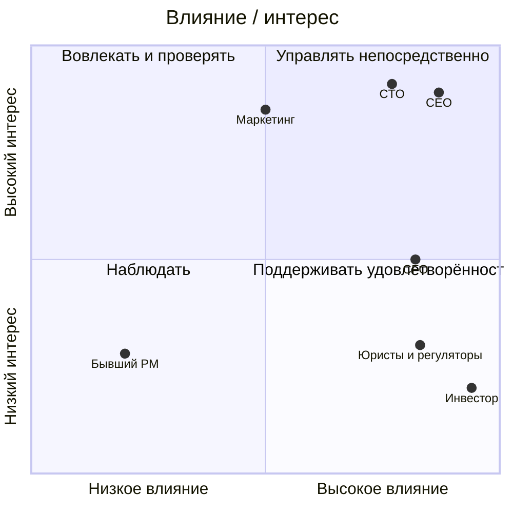

# Stakeholder Matrix — Africa Delivery

| Стейкхолдер | Ожидаемый результат / критерий успеха | Влияние / интерес | Приоритет в конфликте | Коммуникация |
|---|---|---|---|---|
| К. Орлов, инвестор | 15 октября: покупки, выплаты продавцам в тот же день, отсутствие заметного простоя, законное обращение с данными; рост в 15 стран | Высокое / низкий | **1 — бизнес-компромиссы**; согласует изменение обещаний и объёма, но не отменяет закон и финансовый потолок | Одностраничный английский decision brief: варианты, стоимость, последствия, требуемое решение до его отъезда ([арт. 1](../artifacts.md#artifact-1), [арт. 7](../artifacts.md#artifact-7)) |
| М. Лефевр, CEO | Выполнимый первый релиз и управляемые обязательства компании | Высокое / высокий (допущение) | **2 — владелец scope и запуска**; выносит нерешённые бизнес-конфликты инвестору | Короткий реестр решений и еженедельный review релиза; отдельные эскалации по обещаниям ([арт. 1](../artifacts.md#artifact-1)) |
| А. Вебер, CFO | Runway, потолок $5 тыс./мес., комиссия платежей <2,5% GMV | Высокое / средний | **Вето на расход**: письменное согласование позиции >$500/мес.; бюджет и найм не расширены | TCO, цена заказа, коммерческое предложение и альтернатива до Найроби ([арт. 6](../artifacts.md#artifact-6)) |
| А. Нвосу / местные юристы и регуляторы | Правомерность обработки данных, маркетинга, платежей и возвратов | Высокое / низкий | **Вето на незаконный сценарий**; предварительное письмо не заменяет окончательного заключения | Письменные заключения по юрисдикциям, договоры и отдельный список блокирующих правовых решений ([арт. 3](../artifacts.md#artifact-3)) |
| Р. Менон, CTO | Надёжная и расширяемая платформа, контроль над логистикой и платежами | Высокое / высокий | **3 — техническое решение в утверждённых границах**; его целевая схема не задаёт бюджет или дату | ADR с вариантами, SLO, нагрузочным профилем и стоимостью эксплуатации до Найроби ([арт. 5](../artifacts.md#artifact-5), [арт. 8](../artifacts.md#artifact-8)) |
| С. Алмейда, Head of Marketing | Кампания 15 октября, обещания доставки/возврата/языков, работающие ссылки 1 октября | Среднее / высокий (допущение) | **4 — критический владелец внешних обещаний**; при невозможности исполнения эскалация CEO и инвестору | Сверка каждого обещания с проверенным сценарием и отдельный launch checklist ([арт. 2](../artifacts.md#artifact-2)) |
| Платёжные провайдеры и операторы доставки | Выполнимые условия интеграции, платежей, выплат и доставки | Среднее / не определён | **5 — источник проверки реализуемости**; договорные ограничения партнёров важнее гипотез команды | Согласовать ответственных за интеграцию, рабочие встречи, договоры и сквозной пилот; партнёры ещё не выбраны ([арт. 3](../artifacts.md#artifact-3), [арт. 5](../artifacts.md#artifact-5)) |
| Продавцы, курьеры, покупатели | Получить товар и деньги в обещанный срок; доверие, доступность на слабой связи | Среднее / не определён | **5 — источник проверки пользовательских сценариев**; участие представителей в интервью и пилоте нужно согласовать | Интервью с продавцами, пилот маршрутов и платежей, наблюдение за сценариями на дешёвом Android ([арт. 1](../artifacts.md#artifact-1), [арт. 2](../artifacts.md#artifact-2), [арт. 4](../artifacts.md#artifact-4), [арт. 5](../artifacts.md#artifact-5)) |
| Т. Брэдли, бывший PM | Максимальный набор функций к запуску | Низкое / низкий | **6 — источник гипотез, не утверждённый scope** | Асинхронная разметка списка по ценности и обязательствам; решения принимает CEO ([арт. 1](../artifacts.md#artifact-1), [арт. 4](../artifacts.md#artifact-4)) |

На диаграмме показаны только стейкхолдеры с назначенной оценкой интереса. Координаты условные; CFO со средним интересом расположен на границе квадрантов.

