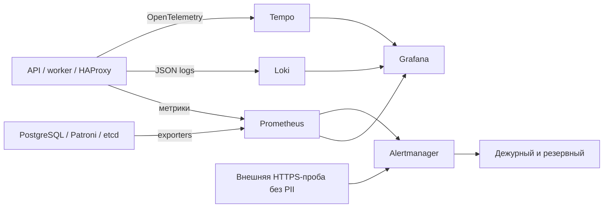

# Наблюдаемость

Источник: [НФТ](nfr-registry.md), [CTO](../artifacts.md#artifact-5). Владелец — SRE.

| Сигнал | Метрики | Связь с SLI / действие |
|---|---|---|
| Задержка | HTTP histogram, pending age, outbox age | P99 каталога; 60 с оплаты/сообщений |
| Трафик | Запросы/с, команды, сообщения | Знаменатели SLI; контроль пика 360 RPS |
| Ошибки | 5xx, timeout, 429, ошибки партнёров | Числители неуспеха; тревога по бюджету |
| Насыщение | CPU, RAM, диск, SQL connections, replication lag | CPU>80% 15 мин; свободный диск<20%; риск SLO |

Сбор размещён в Нигерии. trace_id связывает запрос, outbox и вызов партнёра; тела запросов, токены и PII исключены. Трассировка — 10% штатных запросов и ошибки при доступности коллектора. Метрики SLI собираются для всех запросов.

Для каталога/приёма платежей: расход бюджета >14,4× одновременно за 5 мин и 1 ч — вызов дежурного; >6× за 30 мин и 6 ч — срочная задача. Потеря кворума и провал внешних проб 30 с — немедленный вызов. Ответ дежурного ≤5 мин, автоматическое переключение выполняется раньше.

## Assumptions

Хранение: метрики 30 дней, логи 14 дней, traces 7 дней. Внешние пробы контролируют также отказ самого мониторинга. Бюджет инструментов — $100/мес. из Task2; объём проверяется на пилоте.
