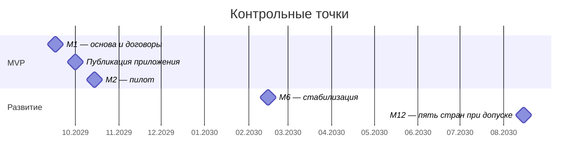

# Roadmap

Источники: [PM](../artifacts.md#artifact-4), [CFO](../artifacts.md#artifact-6), [Task2](../Task2/options-comparison.md).

## Assumptions

Плановое окно разработки — 20 августа–15 октября 2026; выполнение прошедших этапов не подтверждено. При позднем фактическом старте CEO сокращает пилот. До М6 — максимум 3 000 заказов/мес.; это пересмотр исходного прогноза 300 тыс. заказов/год, требующий утверждения инвестором. ФОТ и дежурства учитываются отдельно от $5 000.

| Точка | Scope | Команда | Инфраструктура / мес. | Интеграции / мес. |
|---|---|---|---:|---:|
| М1 | Каталог, заказ, sandbox оплаты, consent, CI; договоры | 6 | До $2 491,38 | До $50 тестовых сервисов |
| М2 | 7 сокращённых пунктов PM, пилот Lagos; нагрузочные/failover-тесты | 6 | $2 491,38 | $1 977 при 3 000 заказов |
| М6 | Стабильный MVP, ограниченный поиск/отзывы; подготовка Кении и ЮАР | 6, продление контрактов | До $2 726,28 | До $1 977; общий лимит $4 703,28 |
| М12 | Нигерия, Кения, ЮАР и ещё две страны после выбора; адаптеры стран | 6 минимум; найм только после бюджета | Плановый ориентир $13 631,40 | Пересчитать по тарифам и объёмам стран |

М12: инфраструктурный ориентир = 5 × $2 726,28; это допущение для бюджета расширения. Страны 4–5 выбирает бизнес. Утверждение бюджета и договоров предшествует расширению.

## Сокращение списка PM

Номера соответствуют порядку 29 пунктов артефакта 4. В MVP — **7 пунктов в сокращённом виде**, 22 отложены. Сквозной заказ, уведомления и согласия — обязательная основа потока покупки.

| Пункты PM | MVP / следующий этап |
|---|---|
| 1 — каталог | MVP: ограниченные категории и атрибуты |
| 10 — кабинет продавца | MVP: товары, остатки, заказы; аналитика позже |
| 11 — оплаты | MVP: Paystack, локальные карты/переводы; остальные способы после договора |
| 18 — отслеживание | MVP: статусы партнёра; карта и точный ETA позже |
| 20 — возвраты | MVP: заявка и ручная сверка; срок возврата по способу оплаты |
| 25 — клиенты | MVP: PWA и оболочка приложения; полный нативный паритет позже |
| 26 — back-office | MVP: проверка продавца, модерация, споры и возвраты |
| 2, 7, 28 — поиск, отзывы, dashboard | М6, упрощённые версии |
| 8, 9, 24 — WhatsApp/USSD и офлайн-заказ | М6 исследование; М12 при подтверждённом спросе |
| 6, 16, 23, 27 — чат, акции, referral, GraphQL | М12 при измеримой ценности |
| 3, 4, 5, 12, 13, 14, 15, 17, 19, 21, 22, 29 | После М12: голос, AI, live, кредит, кошелёк, крипто, игры, динамические цены, видео ПВЗ, ML, B2B, тема |

Критерий включения: необходим для завершения и сопровождения покупки, реализуем шестью людьми за восемь недель. Изменения рекламы и исключение наличных из пилота утверждают CEO и инвестор.

## Команда и дежурства

CTO — техническое решение; CEO — scope и партнёры; CFO — расходы. Разработка: 2 backend, frontend, mobile, full-stack, SRE. Формат — удалённый, с ежедневным двухчасовым пересечением; поездка в Найроби нужна для решения стейкхолдеров.

Три обученные пары: SRE+backend-1, backend-2+full-stack, frontend+mobile. Каждая покрывает 8 часов суток по фактическим часовым поясам, primary/backup меняются еженедельно; через неделю пары меняют окна. SRE/CTO — эскалация, runbook и учения обязательны. Это on-call, дневная разработка сокращается после ночного инцидента. Компенсация — общий бюджет $2 400/мес.; при невозможности покрыть отпуска нужен отдельный бюджет поддержки.

До 1 октября — доступные ссылки и опубликованный клиент. До запуска — договоры, данные, возврат, SLO-тесты и оплата инфраструктуры. Закупки инициируются на первой неделе: карта требует трёх недель; позиции >$500/мес. согласует CFO. Годовых предоплат нет.

## Решения для Найроби

Утвердить 7 сокращённых функций, Lagos, лимит 3 000 заказов, пересмотр рекламы, модель партнёров и исключения CN. Основа обсуждения — ADR-001 и смета Task2.
